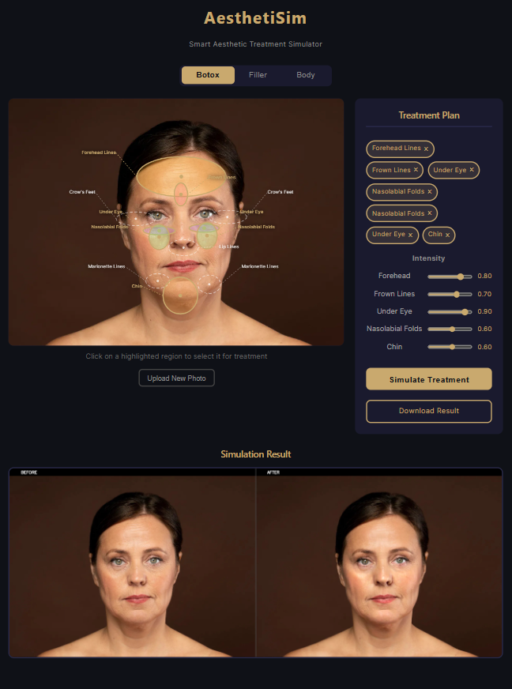
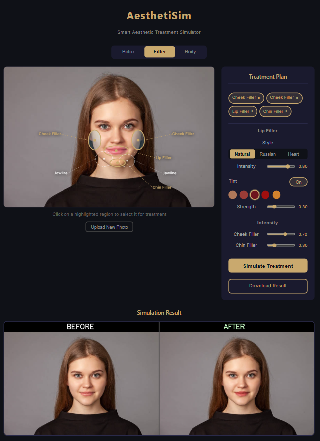

# AesthetiSim — Aesthetic Treatment Simulator

A computer vision-powered aesthetic treatment simulator designed for cosmetic clinics. Allows doctors to show patients realistic before/after previews of botox and filler treatments before any procedure.

---

## What It Does

AesthetiSim lets doctors upload a patient photo and simulate the expected results of:

- **Botox** — forehead lines, frown lines, crow's feet, under-eye, nasolabial folds, lip lines, marionette lines, chin
- **Filler** — cheeks, jawline, chin, lips (with shape and tint options)

The simulation preserves natural skin texture and tone — results look like real treatment photos, not filters.

---

## How It Works

1. Doctor uploads a front-facing patient photo
2. System detects 468 facial landmarks automatically using MediaPipe FaceMesh
3. Doctor clicks treatment zones directly on the face
4. Doctor adjusts intensity per zone
5. System simulates and shows before/after side by side in seconds

---

## Technology

| Component | Technology |
|---|---|
| Backend | FastAPI + Python |
| Face Detection | MediaPipe FaceMesh (468 landmarks) |
| Image Processing | OpenCV |
| Botox Simulation | Frequency separation + morphological analysis on LAB colorspace |
| Filler Simulation | Mesh warping with cv2.remap |
| Frontend | React + Vite |
| Landmark Overlay | HTML5 Canvas |

---

## Features

**Botox Mode:**
- 9 independent treatment zones
- Per-zone intensity control
- Real-time landmark overlay on patient photo
- Frequency separation preserves natural skin texture

**Filler Mode:**
- Cheek, jawline, chin, lip filler simulation
- Lip shapes: Natural, Russian, Heart
- Lip tint colors: Nude, Rose, Berry, Red, Coral
- Landmark-based region detection

**Privacy:**
- All processing done locally — no photos sent to external servers
- Photos processed in memory only — never written to disk
- Full Saudi Arabia PDPL compliance

---

## Project Structure

beauty-simulation-engine/
├── backend/
│   ├── features/
│   │   ├── botox.py                   # Botox simulation pipeline
│   │   ├── filler.py                  # Cheek, jaw, chin filler simulation
│   │   ├── lips_mesh_advanced.py      # Lip filler with shapes and tints
│   │   └── breast.py                  # Breast simulation (in development)
│   ├── utils/
│   │   └── face_detect.py
│   └── main.py                        # FastAPI endpoints
└── frontend/
    ├── public/
    └── src/
        ├── App.jsx                    # Main React component
        ├── App.css                    # Styling
        ├── main.jsx
        └── index.css


---

## API Endpoints

| Endpoint | Method | Description |
|---|---|---|
| /landmarks | POST | Detect face regions from photo |
| /simulate/botox | POST | Run botox simulation |
| /simulate/filler | POST | Run filler simulation |
| /simulate/advanced | POST | Run lip filler with style and tint |

---

## Setup and Running

**Requirements:**
- Python 3.9+
- Anaconda
- Node.js

**Backend:**
```bash
conda activate beauty-env
cd beauty-simulation-engine
uvicorn backend.main:app --reload
```

**Frontend:**
```bash
cd beauty-simulation-engine/frontend
npm install
npm run dev
```

Open `http://localhost:5173` in your browser.

---

## Built By

Amani Bara — Computer Science / AI Graduate, Effat University

## Demo

### Botox Simulation


### Filler Simulation  

